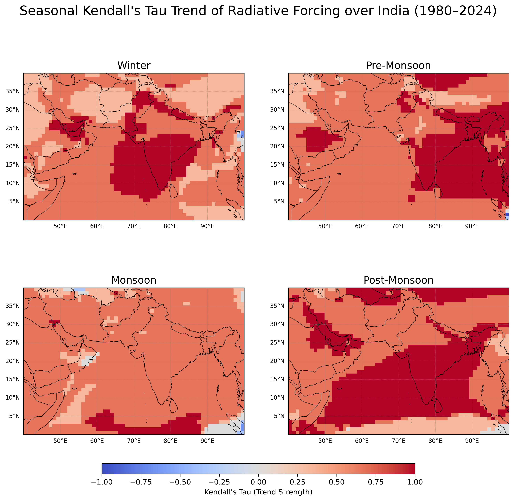

# Climate Trend Detection Using Mann–Kendall

A Python-based implementation of the Mann–Kendall trend test for detecting long-term seasonal trends in aerosol radiative forcing over the Indian subcontinent using NASA MERRA-2 atmospheric reanalysis data.

---

# Project Overview

This repository presents a statistical analysis of long-term trends in aerosol radiative forcing over India using the non-parametric Mann–Kendall trend test.

The analysis utilizes seasonal mean radiative forcing derived from NASA's MERRA-2 atmospheric reanalysis dataset for the period **1980–2024**. Seasonal Kendall's Tau values are computed at every spatial grid point to identify regions exhibiting increasing, decreasing, or statistically significant trends.

The project demonstrates the application of statistical trend analysis, scientific computing, and geospatial visualization techniques to climate datasets.

---

# Objectives

- Detect long-term seasonal trends in aerosol radiative forcing.
- Apply the Mann–Kendall trend test at each spatial grid point.
- Compute Kendall's Tau trend strength.
- Visualize seasonal trend patterns across the Indian subcontinent.

---

# Key Features

- Seasonal trend analysis
- Mann–Kendall trend detection
- Kendall's Tau estimation
- Geospatial visualization
- Scientific Python workflow

---

# Dataset

## Data Source

NASA MERRA-2 Atmospheric Reanalysis

NASA GES DISC

https://disc.gsfc.nasa.gov/

NASA’s Giovanni platform

https://giovanni.gsfc.nasa.gov/giovanni/


---

## Study Region

Indian Subcontinent

Latitude:
0°N–40°N

Longitude:
40°E–100°E

---

## Study Period

January 1980 – December 2024

45 years

---

# Methodology

```
MERRA-2 Radiative Forcing Data

↓

Seasonal Averaging

↓

Extract Seasonal Time Series

↓

Apply Mann–Kendall Test

↓

Compute Kendall's Tau

↓

Evaluate Statistical Significance

↓

Generate Seasonal Trend Maps
```

---

# Repository Structure

```
Climate-Trend-Detection-Using-Mann-Kendall

├── README.md

├── LICENSE

├── requirements.txt

│

├── src/

│ └── seasonal_mann_kendall_trend_analysis.py

│

├── figures/

│ └── README.md
  └── Seasonal_Kendall_Tau_Combined.png
│

├── data/

  └── DATASET_INFORMATION.md


```

---

# Analysis Performed

## Seasonal Trend Analysis

Seasonal mean aerosol radiative forcing was calculated for:

- Winter (DJF)
- Pre-Monsoon (MAM)
- Monsoon (JJAS)
- Post-Monsoon (ON)

The Mann–Kendall trend test was applied independently at each spatial grid cell.

---

## Kendall's Tau

Kendall's Tau measures the direction and strength of monotonic trends.

- Positive Tau → Increasing trend (+1)
- Negative Tau → Decreasing trend (-1)
- Tau ≈ 0 → No significant monotonic trend

---

## Statistical Significance

Grid cells with **p < 0.05** are highlighted as statistically significant, indicating trends that are unlikely to have occurred by chance.

---

# Results

The figure below presents seasonal Kendall's Tau maps over the Indian subcontinent. Each panel corresponds to one climatological season and displays the spatial distribution of trend strength. Grid cells with **p < 0.05** are highlighted as statistically significant,but it not marked in the map.





---

# Technical Skills Demonstrated

- Python Programming
- Scientific Computing
- Climate Data Analysis
- Mann–Kendall Test
- Multi-dimensional Array Processing
- Geospatial Mapping
- Data Visualization

---

# Python Libraries

- NumPy
- Matplotlib
- Cartopy
- PyMannKendall

---

# Reproducibility

The repository contains the complete Python implementation required to reproduce the seasonal Mann–Kendall trend analysis using NASA MERRA-2 radiative forcing datasets.

---

# How to Run

Install dependencies

```bash
pip install -r requirements.txt
```

Run the analysis

```bash
python src/mann_kendall_trend_analysis.py
```

---

# Future Work

- Sen's Slope estimation
- Machine learning-based climate trend prediction

---

# Author

**Anugraha Abraham**

M.Sc. Physics

M.Sc. Data Science Student (Attending from July 2026)

Research Interests

- Climate Data Analysis
- Statistical Analysis
- Scientific Computing
- Data Science
- Machine Learning

---

# Acknowledgements

NASA GES DISC's Giovanni Platform for providing the MERRA-2 atmospheric reanalysis dataset.
